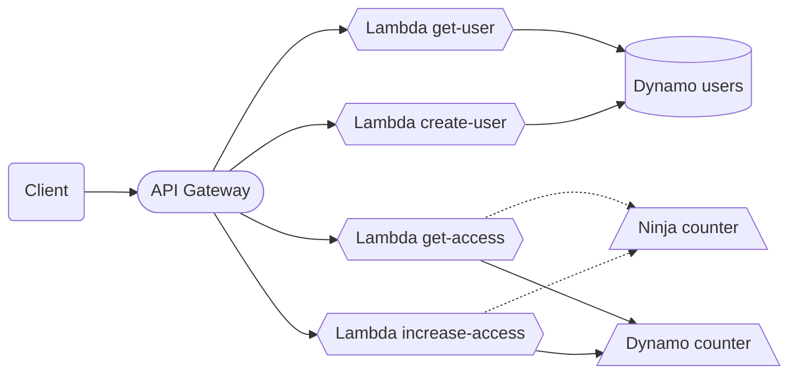

# Components

```mermaid
flowchart LR
C(Client)
AP([API Gateway])
GU{{Lambda get-user}}
CU{{Lambda create-user}}
GA{{Lambda get-access}}
IA{{Lambda increase-access}}
DB[(Dynamo users)]
NJ[/Ninja counter\]
DC[/Dynamo counter\]

C --> AP
AP --> GU
AP --> CU
AP --> GA
AP --> IA
GU --> DB
CU --> DB
GA -.-> NJ
IA -.-> NJ
GA --> DC
IA --> DC
```
